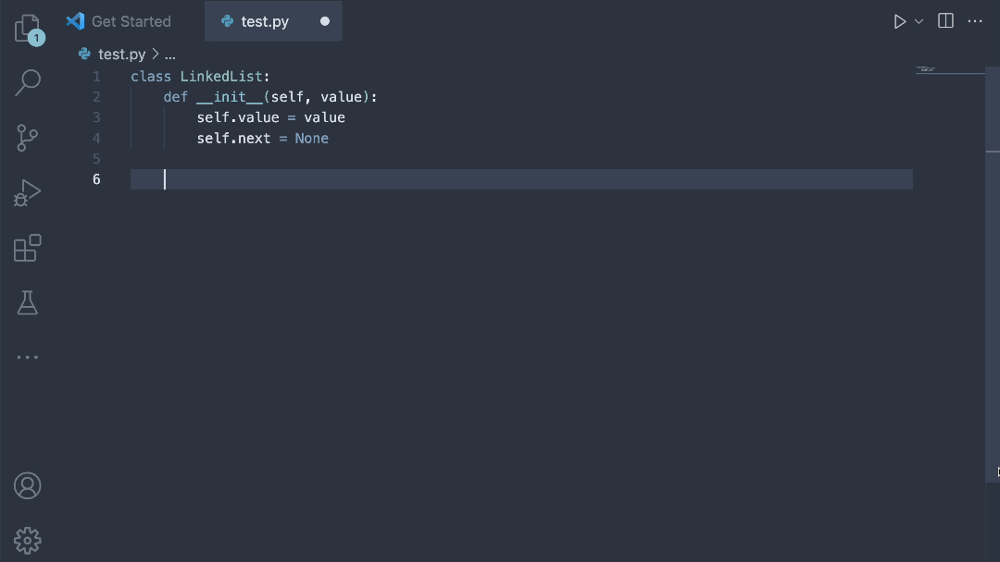

# Maverick — AI Code suggestion for Python in VSCode

[](https://marketplace.visualstudio.com/items?itemName=YurtsAI.maverick) [](https://marketplace.visualstudio.com/items?itemName=YurtsAI.maverick) [](https://discord.gg/qgUprRUX)

Maverick is a code completion tool powered by AI. Built at [Yurts](https://www.yurts.ai/), Maverick focuses on delivering the best code completion on your local machine without reaching out to any APIs or knowledge bases. Best of all? It's **free**.



---

Table of contents:

- [Maverick — AI Code suggestion for Python in VSCode](#maverick--ai-code-suggestion-for-python-in-vscode)
  - [1. Install extension from the marketplace](#1-install-extension-from-the-marketplace)
    - [System Requirements](#system-requirements)
    - [Installation](#installation)
      - [Common reasons why you can't run Maverick:](#common-reasons-why-you-cant-run-maverick)
      - [Still not running?](#still-not-running)
      - [Slow?](#slow)
  - [2. How to use](#2-how-to-use)
    - [Inline Completion using AI](#inline-completion-using-ai)
  - [3. Advanced Settings](#3-advanced-settings)
  - [4. Changelog](#4-changelog)

---

## 1. Install extension from the marketplace

### System Requirements

Maverick can be installed on the following platforms:

- `windows-x64` (Windows 64-bit)
- `darwin-x64` (macOS 64-bit Intel)
- `darwin-arm64` (macOS M-Series)
- `linux-x64`
- `linux-arm64`

### Installation

During installation, the Maverick packaged application as well as the code completion model is downloaded. Installation can take ~10 minutes and may vary based off internet speed and compute resources.

> **DISCLAIMER**: Inference speeds may be slow, but we are actively working to further optimize them. Please be patient and see [Advanced Settings](#3-advanced-settings) to configure Maverick to best suit your computer's architecture.

Have questions or issues with install? Join our [Discord server](https://discord.gg/qgUprRUX) or file a Github [Issue](https://github.com/YurtsAI/maverick/issues).

#### Common reasons why you can't run Maverick:

- Port is not available. If this is the case, hit `cmd/crtl + shift + p` and type `"Settings"`. Then, select `Open Settings (UI)` and search `"Maverick port"`. By default, the Maverick model runs on port `9401`, but you can change this to whichever port you prefer.
- When pressing `Run debugger`, it shows different target options (nodejs, edge, etc.). Your VSCode root directory might be incorrect. Make sure your root directory is the folder in which the `package.json` file is.
- Error message `module "node-fetch" not found...`. You need to run `npm install`.

#### Still not running?

- You haven't enabled the inline completion feature. To enable, set VSCode config `"editor.inlineSuggest.enabled": true`
- It might conflict with some other plugins. You might need to disable plugins to check

If none of the above works, open a thread or join our [Discord channel and have a chat](https://discord.gg/qgUprRUX).

#### Slow?

If latency is an issue, try to decrease `maxTokensToGenerate` or `numLinesForContext` in your VSCode settings. To access these settings, hit `cmd/ctrl + shift + p` and type `"Settings"`. Then, select `Open Settings (UI)` and search `"Maverick"`. For more information, see [Advanced Setttings](#3-advanced-settings).

## 2. How to use

### Inline Completion using AI

AI inline completion triggers on the **key command `cmd + shift + m` (macOS) or `ctrl + shift + m` (Windows/Linux)**.

For example, if the following was typed into your editor:

```python
class LinkedList:
```

Hitting `cmd + shift + m` or `ctrl + shift + m` would then send the prediction request to Maverick. (_You can tell a prediction is in progress if the Status Message in the bottom left of VSCode reads "Maverick generating code..."_) The prediction will then render as an inline suggestion!

## 3. Advanced Settings

Maverick comes equipped with three tunable settings depending on a user's desired workflow, including:

- `port`: Defaults to `9401`, the port where the Maverick model will be hosted.
- `maxTokensToGenerate`: Defaults to `32`, the number of tokens you would like to generate for every Maverick prediction. A token is similar to a word, but sometimes may be smaller.
- `numLinesForContext`: Defaults to `10`, the number of previous lines of code to send as context for every Maverick prediction.

> **WARNING**: Latency is positively correlated with `maxTokensToGenerate` and `numLinesForContext`, i.e., increasing these values may increase latency and vise versa.

Feel free to modify these settings to best fit your workflow.

## 4. Changelog

- Nov 03, 2022 - Add deload model logic
- Nov 02, 2022 - Publish the initial version

**_Love Maverick? Please drop us a star :) and expand the [yurt](https://www.yurts.ai/)._**
